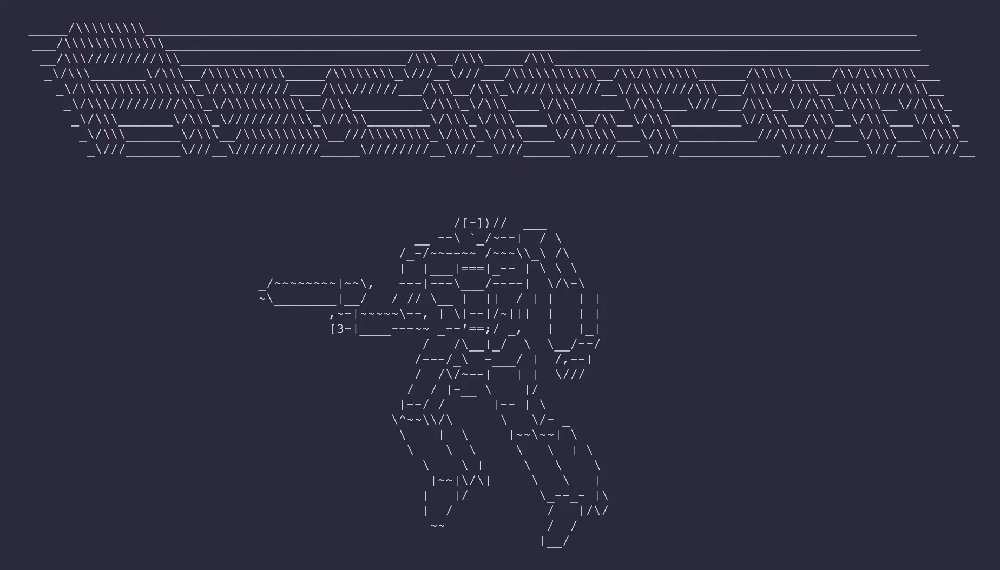

# ASCIItron 🕹️



ASCIItron is a retro-style ASCII shooter game built with vanilla JavaScript. Navigate through waves of enemies, rack up high scores, and compete for the top spot on the global leaderboard.

## Game Mechanics

### Core Gameplay
- Control your character (@) using WASD keys for movement
- Shoot bullets (*) using arrow keys in four directions
- Survive waves of enemies while scoring points

### Enemies
Regular Enemies:
- '&' (33% spawn rate)
- '%' (17% spawn rate)
- '#' (50% spawn rate)

Boss Types (every 5 waves):
- Tank Boss ($$): Slow movement, drops mines
- Shooter Boss (@@): Fires projectiles in patterns
- Spawner Boss (%%): Hides behind regular enemies

Enemy behavior:
- Regular enemies spawn from all sides
- Move towards the player
- Regular enemies die in one hit
- Kill player on contact
- Regular enemies worth 10 points
- Bosses worth 20 points

### Wave System
- Each wave starts with enemies equal to wave number
- Wave increases when all enemies are cleared
- Boss waves occur every 5 waves
- Difficulty increases progressively:
  - Spawn rate: starts at 1%, increases 15% per wave (max 8%)
  - Enemy speed: starts at 0.1, increases 8% per wave (max 0.6)

### Scoring
- 10 points per enemy destroyed
- Score persists through waves
- Local and online leaderboards
- Tracks personal stats:
  - Highest score
  - Highest wave
  - Games played
  - Total score

### Controls
- WASD: Movement
- Arrow Keys: Shoot
- Space: Start game
- T: View scores
- Y: View instructions
- U: View stats
- V: Save score (after game over)
- R: Restart (after game over)

## Technical Stack

- **Frontend:** Vanilla JavaScript, HTML5, CSS3
- **Backend:** Cloudflare Workers / Node.js (Self-hosted)
- **Database:** Cloudflare KV Storage / JSON File (Self-hosted)
- **Hosting:** Cloudflare Pages / Docker
- **Design:** Catppuccin Mocha Color Scheme

## Features

- **Responsive ASCII Graphics:** Pure text-based visuals that work across devices
- **Global Leaderboard:** Compete with players worldwide
- **Persistent Stats:** Track your highest score, waves survived, and total games
- **Secure Score Submission:** Username/password system with SHA-256 hashing
- **Progressive Difficulty:** Increasing challenge with each wave
- **Keyboard Controls:** Full keyboard navigation throughout the game

## Getting Started

1. Visit [https://asciitron.lkly.net](https://asciitron.lkly.net)
2. Press **Space** to start the game
3. Use **WASD** to move and **Arrow Keys** to shoot
4. Create credentials (username#password) to save your scores

### Local Development

1. Clone the repository
2. Serve the files using a local HTTP server (e.g., `python -m http.server`)
3. No build step required - edit and refresh

## Self-Hosting

You can host ASCIItron on your own server using Docker.

### Using Docker Compose

1. Clone the repository:
   ```bash
   git clone https://github.com/lklynet/asciitron.git
   cd asciitron
   ```

2. Start the container:
   ```bash
   docker-compose up -d
   ```

3. Access the game at `http://localhost:3000`.

### Using Docker Image

You can also run the pre-built image directly:

```bash
docker run -d -p 3000:3000 -v $(pwd)/data:/app/data ghcr.io/lklynet/asciitron:latest
```

The game data (scores) will be persisted in the `./data` directory.

## Security

- Scores are saved using username#password format
- Passwords are hashed using SHA-256 before transmission
- Score submission is protected against spam
- Input validation on both client and server sides
- Usernames limited to 12 characters

## Contributing

1. Fork the repository
2. Create a feature branch
3. Commit your changes
4. Push to the branch
5. Open a Pull Request
